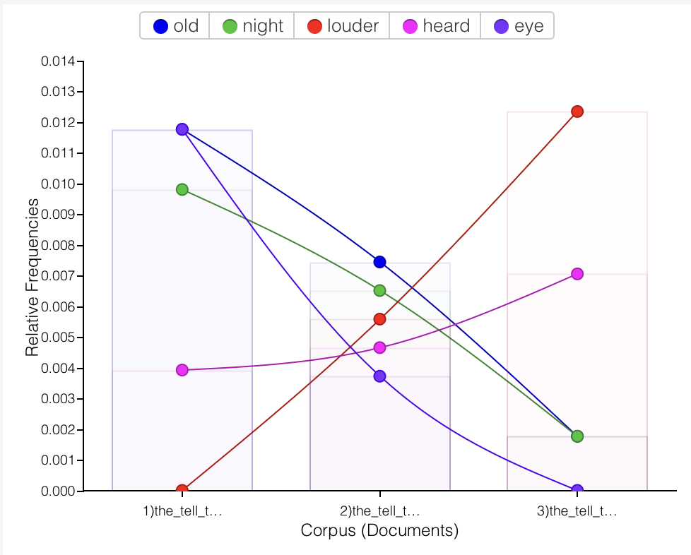
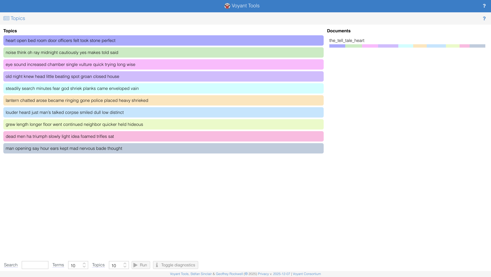

# The Tell-Tale Heart Analysis

## Close Reading

### Themes

1. **Madness vs. Sanity:** The narrator insists he is not mad, but his obsessive focus on the old man’s *“vulture eye”* and his meticulous yet irrational actions suggest profound psychological disturbance.  
2. **Guilt and Paranoia:** The narrator’s hallucination of the dead man’s heart beating beneath the floorboards symbolizes his unbearable guilt and paranoia.  
3. **The Power of Sound:** Hearing is both a source of pride and torment. The heartbeat represents the inescapable truth and the narrator’s own escalating anxiety.  
4. **The Unreliable Senses:** The narrator claims his senses are supernaturally sharp, yet they deceive him into hearing a sound that cannot exist, blurring the line between perception and delusion.  

### Characters

**The Narrator:** Nameless, first-person, unreliable. He is obsessive, paranoid, and possibly suffering from a psychotic disorder. He is the **autodiegetic narrator** (the protagonist telling his own story).  

**The Old Man:** Also nameless. Defined only by his *“evil eye”* and vulnerability. He is a victim with no clear motive for his murder, which heightens the story’s irrational horror.  

**The Police Officers:** Minor characters who serve as a calm, rational contrast to the narrator’s disintegration. Their presence triggers the climax.  

### The Narrator

- **Type:** First-person autodiegetic narrator (he is the protagonist).  
- **Reliability:** Highly unreliable. He contradicts himself, claims sanity while describing insane acts, and is driven by obsession.  
- **Effect:** Creates intense psychological intimacy and forces the reader to piece together the truth from a distorted perspective.  

### Structure

- **Order:** Begins with the narrator defending his sanity, then uses **flashback** to recount the murder, before returning to the present for the climax.  
- **Temporal Markers:** Heavy use of the word *“night”* (*“every night,” “upon the eighth night,” “at midnight”*) to build suspense.  
- **Tense:** Predominantly **past tense**, with shifts to present tense during moments of high tension (e.g., the heartbeat scene), enhancing immediacy.  

**Three-Act Structure:**

1. **Exposition:** The narrator introduces his obsession.  
2. **Murder Sequence:** The careful planning and execution.  
3. **Climax and Confession:** The police visit and auditory hallucination leading to confession.  

### Style

- **Exclamations and Dashes:** Mimics frantic, breathless speech and fragmented thought.  
- **Vivid Imagery:** *“vulture eye,” “thread of the spider,” “hellish tattoo”* — sensory, gothic, and grotesque.  
- **Irony:** The narrator’s claims of sanity undermine themselves with every detail he provides.  

### Interpretation

- **Psychological Horror:** The story is less about the murder and more about the narrator’s mind. The real horror is internal.  
- **Critique of Rationality:** The narrator tries to argue logically for his sanity, yet his logic is utterly unhinged. This exposes the fragility of human reason.  
- **The Haunting of Guilt:** The heartbeat is not supernatural but psychological — a manifestation of conscience that cannot be silenced.  
- **Narrative as Performance:** The narrator addresses the reader directly, performing his sanity, which implicates the reader in judging his madness. This aligns with the discussion of **narratology** — how narrative voice shapes meaning and reader perception.  

## Quantitative VoyantTools Analysis

### Step 1
The most frequent words in the corpus are *old (15), night (13), louder (13), heard (11), eye (10)*.  

- The prominence of *“old”* may indicate a thematic focus on **aging**, **memory**, or **long-standing fear**.  
- *“Night”* reinforces a setting of **obscurity**, **uncertainty**, or psychological tension.  
- Repeated appearances of *“louder”* and *“heard”* point to the importance of **sound** as a narrative device, hinting that auditory perception drives key moments.  
- The frequent use of *“eye”* suggests an emphasis on **being watched**.  

Taken together, the frequencies show that the story constructs its atmosphere through contrasts between what is **seen** (*“eye”*) and what is **heard** (*“louder,” “heard”*), framed within **night** and **oldness**, symbolizing fear, guilt, or decaying psychological states.  

### Step 2
The story was divided into **three parts** to see how key terms shift across the narrative.

#### Part I — *from the beginning to “I looked in upon him while he slept.”*
- *“Old,” “night,”* and *“eye”* appear at their highest relative frequency.  
- The opening focuses on **setting tone and psychology**:  
  - *“Old”* contributes to the narrator’s obsession with the old man and his age.  
  - *“Night”* marks secrecy, preparation, and suspense.  
  - *“Eye”* peaks early, reflecting the fixation on the “vulture eye.”  

#### Part II — *from “Upon the eighth night” to “A tub had caught all — ha! ha!”*
- Sensory vocabulary *“heard”* and *“louder”* rise sharply.  
- The narrative shifts from **visual fixation** (*“eye”*) to **auditory paranoia**.  
- *“Heard”* gains importance during the heartbeat scenes.  
- *“Louder”* increases as the imagined heartbeat grows.  

#### Part III — *from “When I had made an end of these labors” to the end*
- *“Louder”* spikes, reflecting the narrator’s auditory obsession.  
- *“Old”* and *“night”* almost disappear — the original setting and backstory fade.  
- *“Eye”* drops, indicating the narrator is consumed by guilt and hallucination.  

### Step 3
Using the Contexts tool, almost every occurrence of *“eye*”* appears near violent or fear-related words, strengthening its symbolic reading as horror rather than physical description.  

### Step 4
Voyant Tools generated ten thematic clusters. 

 
- Early topics: **Observation and obsession** (Topics 3–4)  
- Middle topics: **Planning and violent action** (Topics 1, 5, 6)  
- Final topics: **Auditory paranoia and psychological disintegration** (Topics 7–10)  

Topic modeling confirms that the story’s central arc is a descent from calculated control into overwhelming guilt, expressed through escalating sensory distortions, especially sound.
